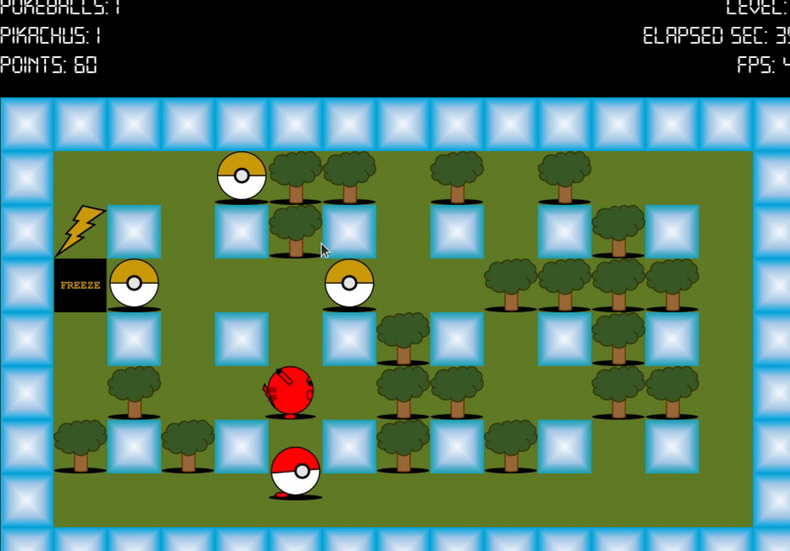

# CTE

A simple grid based game where you catch Pikachus while dodging obstacles. Built in C with Allegro 5.

## What's this


You move around a grid trying to catch Pikachus. Some are tougher than others. Avoid the bad stuff, grab the bonuses, rack up points. Pretty straightforward.

## Features

- Random level generation with catchable/uncatchable obstacles
- Multiple Pikachus per level with varying difficulty
- Bonuses: extra Pokeballs, power ups, freeze time
- Highscore tracking with names and timestamps
- Keyboard controls

## Controls

- **Arrow keys** - Move around
- **Space** - Catch Pikachu / continue in menus
- **ESC** - Pause or exit
- **Backspace** - Delete character when entering name
- **Enter** - Confirm stuff

## Building

You'll need Allegro 5 (core, image, primitives, ttf).

```bash
gcc -o catch_them_all main.c game.c gui.c level.c highscores.c util.c \
    -lallegro -lallegro_image -lallegro_primitives -lallegro_ttf -lm
```

## Running

```bash
./catch_them_all [level] [seed]
```

- `level` - Which level to start at (default: 1)
- `seed` - RNG seed if you want reproducible levels

## Files

- `main.c` - Game loop, level transitions
- `gui.c/h` - Allegro rendering and input
- `level.c/h` - Level generation and entity stuff
- `highscores.c/h` - Save/load highscores
- `util.c/h` - Memory helpers and events
- `catch_them_all.h` - Core structs and definitions

## Game Flow

```
Start Level
    |
    v
Generate Grid
(Pikachus, obstacles, bonuses)
    |
    v
Player Move/Catch
    |
    v
Update & Render
    |
    v
Level Done? --> Next Level
    |
    v
Check Highscore
    |
    v
Game Over
```

## Notes

- Highscores saved in `highscores.dat`
- Tiles are 64x64 pixels
- Call `gui_initialize()` before any GUI stuff
- Level layout varies unless you specify a seed
